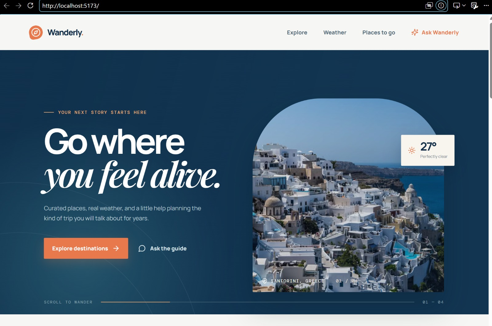
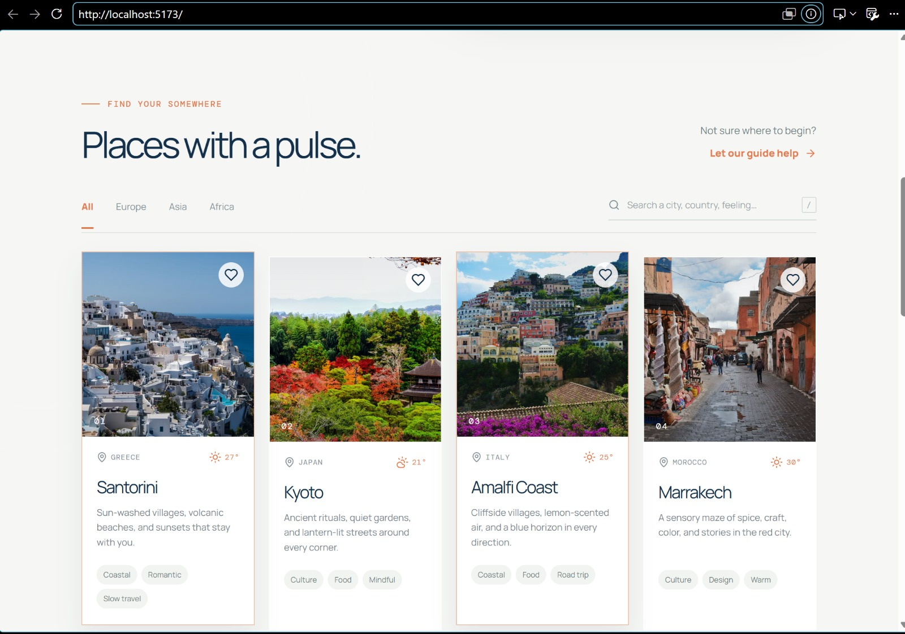
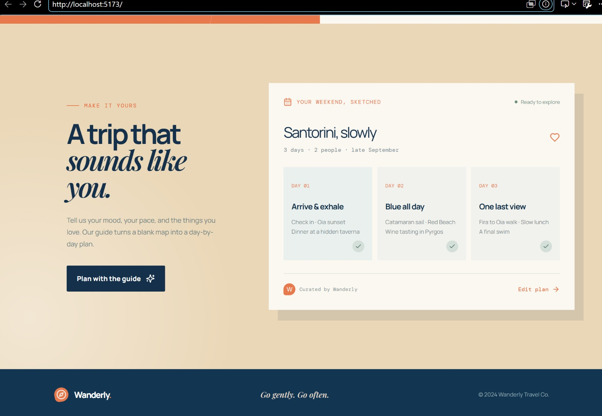

# Wanderly – Travel Discovery & Trip Planning App

## Project Description

Wanderly is a travel discovery and trip planning web application designed to help users explore destinations and plan their travel experiences through a simple, interactive, and responsive interface.

The application provides destination discovery, search and filtering, favorites, location-related functionality, weather information, and trip-planning features.

## Screenshots

### Home Page



### Destination Discovery



### Trip Planner



## Features

- Explore travel destinations
- Search for destinations
- Filter destinations by region
- View destination information
- Add destinations to favorites
- Location-related functionality
- Weather information
- Trip planning functionality
- Interactive navigation
- Responsive design for different screen sizes
- User-friendly travel-focused interface

## API Used

### Supabase API

The application uses the Supabase API as its backend/data service. Supabase provides the connection between the frontend application and the project's backend data.

## Technologies Used

- React
- TypeScript
- Vite
- Tailwind CSS
- Supabase
- Lucide React
- HTML
- CSS

## How to Run Locally

### Prerequisites

Make sure Node.js and npm are installed on your computer.

### 1. Clone the repository

```bash
git clone https://github.com/Balajirupasri/wanderly-travel-app.git
2. Navigate to the project directory
cd wanderly-travel-app
3. Install dependencies
npm install
4. Start the development server
npm run dev
5. Open the application

Open the localhost URL displayed in the terminal.

For example:

http://localhost:5173/
Project Structure
wanderly-travel-app/
├── src/
├── screenshots/
├── index.html
├── package.json
├── package-lock.json
├── vite.config.ts
├── tailwind.config.js
└── README.md
Author

Balajirupasri
